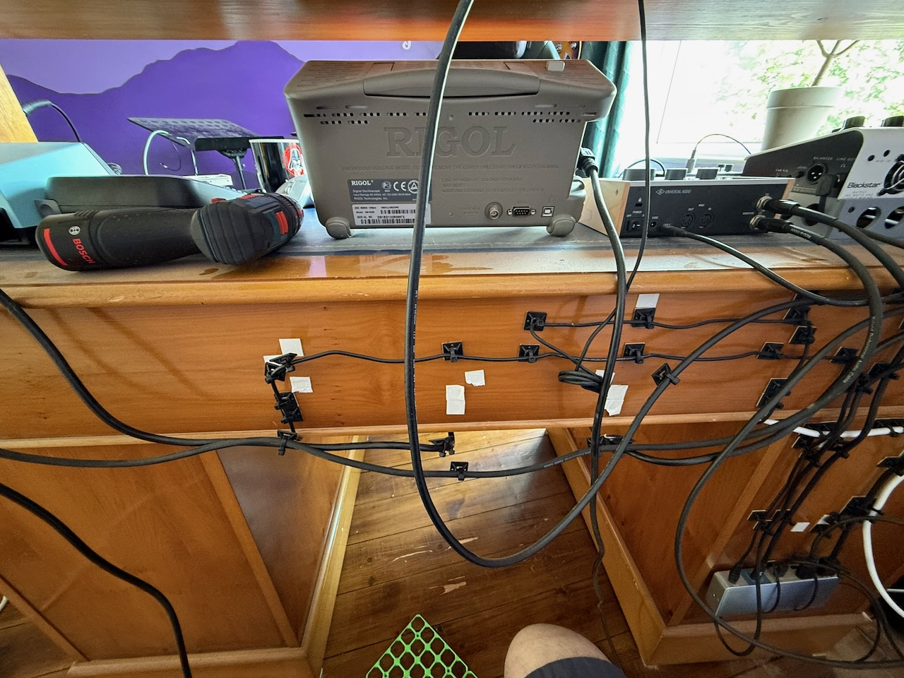
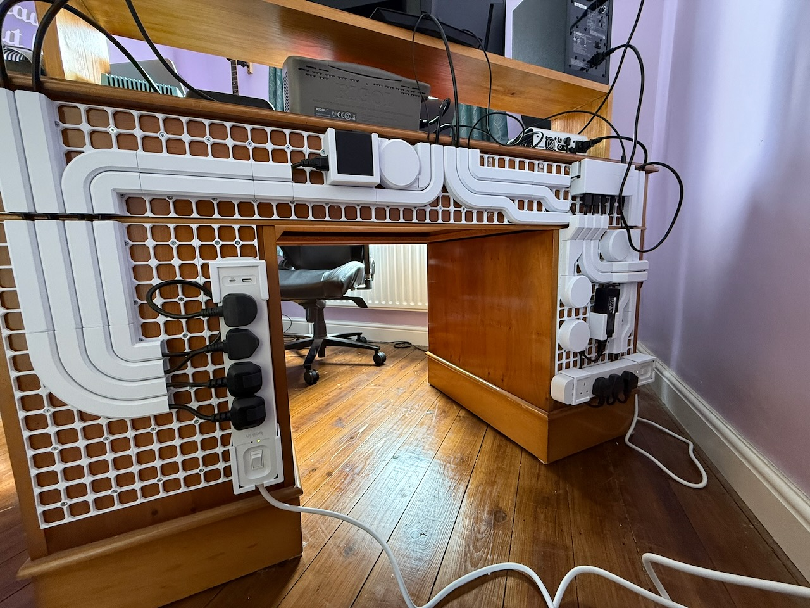

# 3d-printing-underware

Backup of the 3d models I generated and modified to channel cables behind my desk. 

I printed everything over 3 weeks. The teeth on the channels kept breaking during installation on the grid. Even though I really like the end result, I will not be touching this again any time soon.

Before

After

